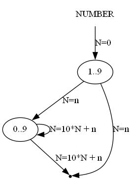

# Техническое задание
Создать инструмент реализации языков предметной области для использования в рамках курса "Грамматики и автоматы".

Обеспечить возможность задавать синтаксис и семантику в разных формах.
Реализовать возможность задавать синтаксис в форме:
* Регулярной форме Бэкуса-Наура
* Диаграмм Вирта

Реализовать возможность задавать семантику в форме:
* Разбора AST на языке программирования общего назначения
* Автоматного объекта на языке CIAO - ориентиром служит реализация в магистреской Орищенко
* В виде исполняемого кода, написанного в диаграмме Вирта - упрощенная Р-технология Вельбицкого

Пример реализации счётного триггера на CIAO:
```
FlipFlop

VAR
button := false

REQUIRED
isItLightOutside()
turnOnLamp()
turnOffLamp()

PROVIDED
buttonPress(mode)
isButtonPressed()

INNER
printInfo(text)

STATE
entry -> / -> ready
ready -> button / -> check
check -> isItLightOutside() / -> error
check -> else / turnOnLamp() -> wait
wait -> !button / turnOffLamp() -> ready
error -> / printInfo("It is light outside") -> exit
```

Пример разбора десятичной записи целого числа при помощи Р-технологии:



[Код диаграммы на языке dot](raw_diagrams/r_technology_sample.gv)

## Программа и методика испытаний
1. РБНФ как DSL\
**Вход:**\
Синтаксис: диаграмма Вирта\
Семантика: код в диаграмме Вирта и разбор AST на ЯП общего назначения\
**Выход:**\
Текст РБНФ\
Диаграмма Вирта РБНФ

2. Язык описания автоматного объекта\
**Вход:**\
Синтаксис: РБНФ или диаграмма Вирта\
Семантика: разбор AST на ЯП общего назначения\
**Выход:**\
Описание автоматного объекта
