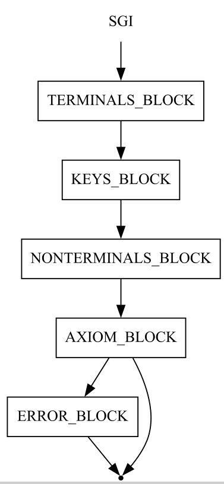

# Примеры
+ `.rbnf` - Extended Backus-Naur Form. Описание грамматики в регулярной форме Бэкуса-Наура. Описание грамматики см. в [документации](../_docs/grammar_description.pdf).
+ `.sgi` - Support Grammar Info. Вспомогательная информация о грамматике. Используется для описания грамматики в форме диаграмм Вирта - описывает лексику, ключевые слова и символы, список нетерминалов. Предствавляет из себя `.rbnf` без блока правил.
+ `.gv` - DOT-диаграммы. Описание грамматики в форме диаграмм Вирта.
+ `.json` - JSON-файлы. Задают параметры для работы программы.

## Формат JSON-файлов
Json-файл может содержать 3 объекта:
+ `syntax`. Служит для описания синтаксиса языка предметной области.
+ `semantics`. Служит для описания семантики языка предметной области.
+ `debugInfoDir`. Директория для вспомогательной информации, которая создаётся в процессе работы. Если отсутсвует - информация не будет сохраняться.

Одна из частей `syntax` и `semantics` может отсутсовать для работы отдельных модулей.

### Объект синтаксиса
Содержит 2 объекта:
- `type` - форма задания синтаксиса. Допустимые значения:
  - `virt` - задание синтаксиса в форме диаграммы Вирта;
  - `rbnf` - задание синтаксиса в форме РБНФ.
- `info` - дополнительная информация о синтаксисе. Зависит от формы описания.

Для диаграмм Вирта объект `info` содержит 2 строки:
+ `supportInfo` - путь к `.sgi` файлу
+ `diagrams` - путь к директории, в которой хранятся диаграммы Вирта.

Для РБНФ объект `info` содержит 1 строкy:
+ `rbnfFile` - путь к `.rbnf` файлу.

### Объект семантики
Содержит 1 объект:
- `type` - форма задания семантики. Допустимые значения:
  - `virt` - задание синтаксиса в форме Р-технологии;
  - `gpl` - задание синтаксиса языком программирования общего назначения;
  - `ciao` - задание синтаксиса в автоматной форме.

## Формат представления диаграмм Вирта
Название графа является названием нетерминала, который определяется этой диаграммой
### Формат рёбер
Все рёбра направленные
### Формат узлов
Виды вершин:
+ начальная - должна иметь тип `plaintext`
+ конечная - должна иметь тип `point`
+ нетерминальные - содержат имя нетерминала или, должен иметь тип `box`
+ терминальные - содержат имя терминала, должен иметь тип `diamond`
+ ключевые - содержат ключи, должны иметь тип `oval`

Условия:
+ Начальные и конечные вершины должны быть в диаграмме единственными.
+ В начальную вершину не могут входить дуги.
+ Из конечной вершины не могут исходить дуги.
+ Конечная вершина должна быть достижима из начальной.

## Грамматика `.sgi`
### РБНФ
```
SGI ::=
    TERMINALS_BLOCK KEYS_BLOCK NONTERMINALS_BLOCK
    AXIOM_BLOCK [ERROR_BLOCK]
```
### Диаграмма Вирта
Описание нетерминалов `TERMINALS_BLOCK`, `KEYS_BLOCK`, `NONTERMINALS_BLOCK`, `AXIOM_BLOCK`, `ERROR_BLOCK` см. в [документации](../_docs/grammar_description.pdf).


```
digraph SGI {
	start [label=SGI shape=plaintext]
	A [label=TERMINALS_BLOCK shape=box]
	B [label=KEYS_BLOCK shape=box]
	C [label=NONTERMINALS_BLOCK shape=box]
	D [label=AXIOM_BLOCK shape=box]
	F [label=ERROR_BLOCK shape=box]
	end [label="" shape=point]
	start -> A
	A -> B
	B -> C
	C -> D
	D -> F
	D -> end
	F -> end
}
```